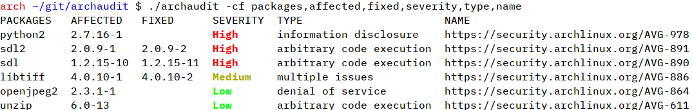

# Installation
`$ wget https://raw.githubusercontent.com/i34/archaudit/master/archaudit && chmod +x archaudit`
```
Usage:
    -h    Show this help message
    -a    Show all fields
          This is equal to -f name,packages,status,severity,type,affected,fixed,ticket,issues
    -f    Custom format, e.g. -f packages,affected,severity,name
    -v    Show all vulnerable packages, not just ones on the system
    -c    Colorize output
```

This is very similar to pacaudit and archsecure, however this allows for custom formatting of the fields and has all the same features (except the nagios plugin in pacaudit, which I plan to add). I also have other features in mind like running as a service, or alongside an update utility.

# Example

